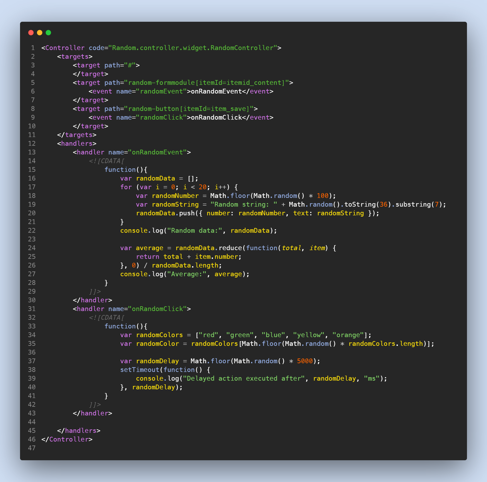

  <h3>
    Highlight Your CDATA Embedded JavaScript
  </h3>
   

> ❌ Without Syntax Highlighting

> ✅ With Syntax Highlighting

## Installation 

You can download the extension from the `Extensions(Ctrl+Shift+X)` tab in Visual Studio Code or directly from Visual Studio Marketplace, link attached below.

[Download CDATA JS Highlighter](https://marketplace.visualstudio.com/items?itemName=PaulGomez.cdata-js-highlighter)

## About

By default, many editors treat XML files containing JavaScript code inside CDATA tags as pure XML, often overlooking the embedded JavaScript. This extension elevates the XML syntax highlighting experience by intelligently identifying JavaScript code within CDATA tags and providing dedicated highlighting. Enjoy improved code readability and a more seamless workflow.

## Author Notes
I used to struggle when working with JavaScript within CDATA tags. That's why I created this extension, to simplify the process as well as make it easier to work with. Feel free to open an issue or  send a pull request.

The screenshots also feature the [SpaceCamp](https://marketplace.visualstudio.com/items?itemName=PaulGomez.spacecamp) color theme. A personal creation of mine, ported from a beloved Vim theme also available [here](https://github.com/jaredgorski/SpaceCamp/tree/master
). Now available as a VS Code theme, feel free to explore and give it a try!

